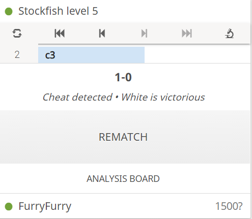

# LichessHack
Allows an AI to play moves for you on a User Account

1) Log into Lichess with an account you don't want to get banned
2) Challenge someone to a lichess game
3) Paste in the javascript code located in hack.js into the webpage console

The AI will start making moves and stuff

## The current bot is FurryBot that I made here: [FurryBot](https://github.com/ManzanaNaranja/FurryBot-ChessAI)
- it is not that good so in the meantime, I plan to replace it with the javascript version of stockfish soon

### How the stuff works

- The script utilizes the chess.js library to keep track of the game
- lichess.org broadcasts the fen on streaming of the game somewhere in the html so I grab that to get the start position
- my script calls the FurryBot.bestmove(fen) function to get best move
- it makes moves with websockets
- it updates position of board (fen) based on dom changes on right

### I tried using stockfish 9 against stockfish 5 and it caught me cheating but hasn't banned me yet

